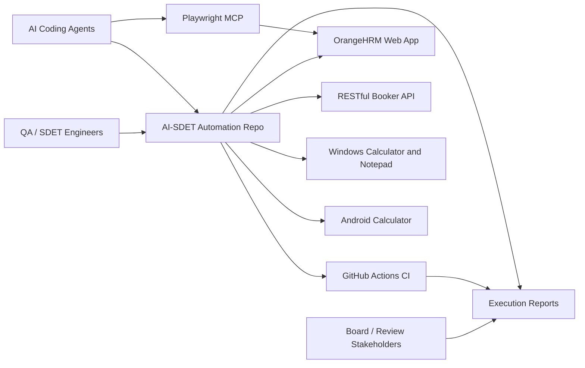
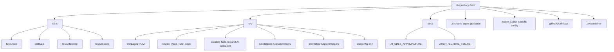
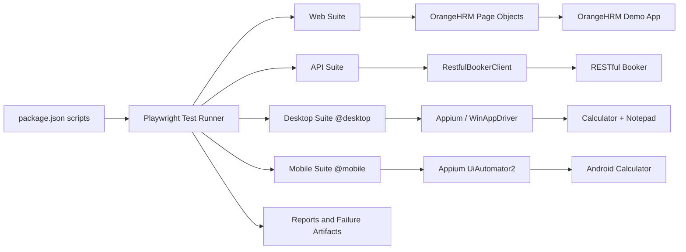
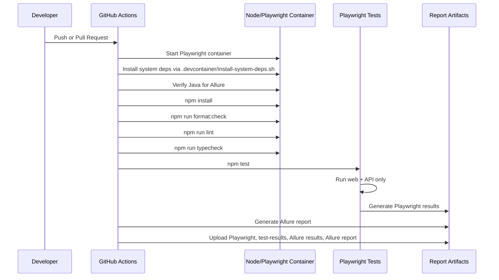
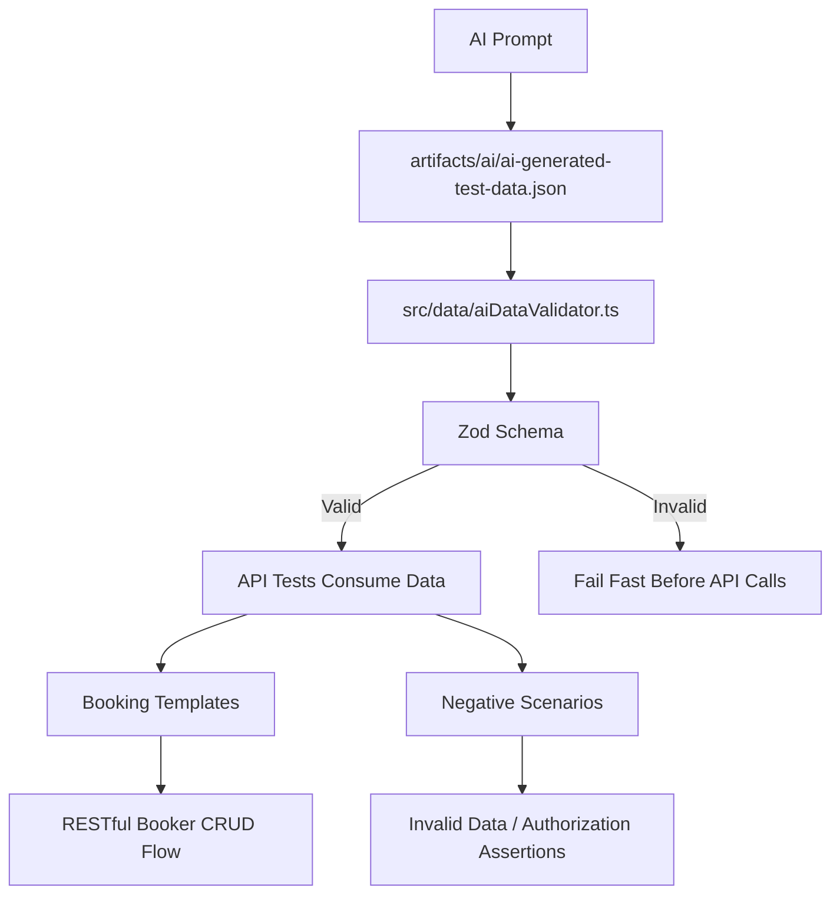
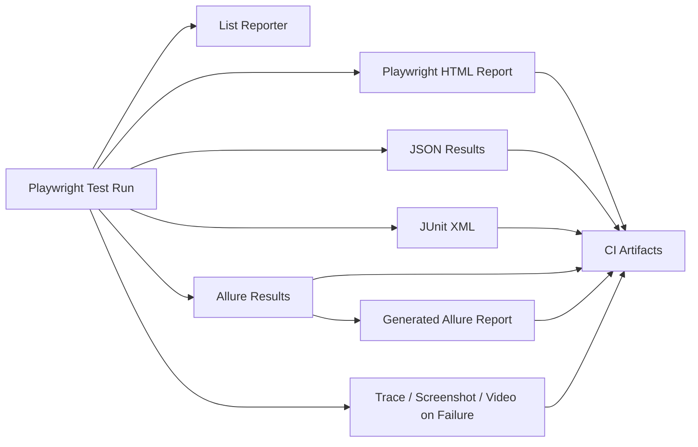
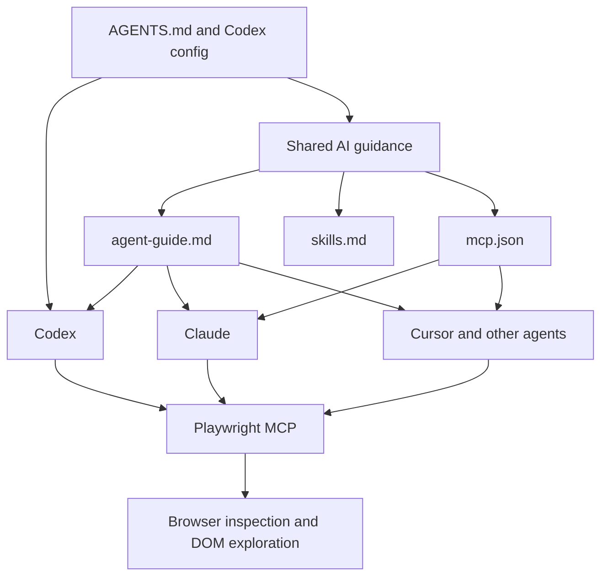
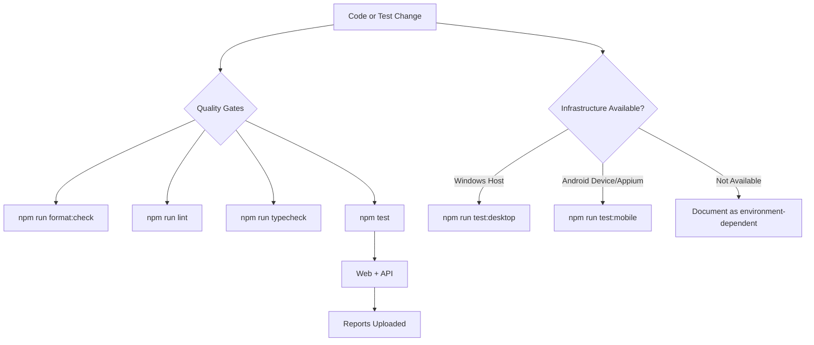

# AI-SDET Automation Framework Architecture TSD

## Executive Summary

This framework provides an enterprise-oriented automation foundation for browser, API, desktop, mobile, and AI-assisted testing. It uses Playwright Test as the common execution and reporting layer while delegating platform-specific interaction to purpose-built helpers: Playwright browser automation for web, Playwright APIRequestContext for API, and Appium/WebdriverIO for desktop and mobile.

The default CI path intentionally runs only web and API tests because those are deterministic inside Linux CI. Desktop and mobile coverage is implemented but executed separately when the required Windows host, emulator, physical device, or cloud device infrastructure is available.

## Board-Level Outcomes

- One framework covers five areas: web, API, desktop, mobile, and AI-assisted test generation.
- Tests produce reviewable reports through Playwright HTML, JSON, JUnit, and Allure.
- AI-generated data is not trusted blindly; it is schema-validated before use.
- CI enforces formatting, linting, type safety, default test execution, and report artifact upload.
- The framework is prepared for multiple AI coding agents through shared `.ai` guidance plus Codex-specific project configuration.

## System Context

## Repository Architecture

## Execution Architecture

## Default CI Flow

## Test Coverage Map

| Area    | Application                   | Test Location              | Automation Layer                  | Default CI | Notes                                                             |
| ------- | ----------------------------- | -------------------------- | --------------------------------- | ---------- | ----------------------------------------------------------------- |
| Web     | OrangeHRM                     | `tests/web`                | Playwright + POM                  | Yes        | Create, search, update, delete, and unaffected-record validation. |
| API     | RESTful Booker                | `tests/api`                | Playwright APIRequestContext      | Yes        | CRUD, negative scenarios, AI-generated data usage.                |
| Desktop | Windows Calculator + Notepad  | `tests/desktop`            | WebdriverIO + Appium/WinAppDriver | No         | Requires Windows GUI host or VM.                                  |
| Mobile  | Android Calculator            | `tests/mobile`             | WebdriverIO + Appium UiAutomator2 | No         | Requires Appium and emulator/device/cloud device.                 |
| AI-SDET | RESTful Booker data/scenarios | `artifacts/ai`, `src/data` | Zod validation + API tests        | Yes        | Validates generated data before consumption.                      |

## AI-Generated Data Validation Flow

## Reporting Architecture

## AI-Agent Enablement Architecture

## Key Design Decisions

### 1. One Runner, Multiple Automation Channels

Playwright Test is the common runner for all capabilities. This gives one reporting model and one CI contract while still allowing Appium/WebdriverIO for native desktop and mobile automation.

### 2. Default CI Is Stable By Design

`npm test` excludes `@desktop` and `@mobile` because those suites require external infrastructure. This keeps pull-request feedback reliable while preserving full coverage through explicit scripts.

### 3. Page Objects Own Web Complexity

OrangeHRM selectors, form synchronization, and UI-specific waits live in `src/pages`. Specs remain scenario-focused and readable for review.

### 4. AI Output Is Validated Before Use

Generated booking templates and negative scenarios are stored as artifacts but must pass a Zod schema before tests consume them. This creates a controlled AI-assisted workflow rather than trusting generated content blindly.

### 5. Reporting Is Multi-Audience

HTML and Allure reports support human review; JSON and JUnit support CI and downstream tooling; traces, screenshots, and videos support failure diagnosis.

## Operational View

## Risk And Mitigation Summary

| Risk                                                            | Mitigation                                                                                                     |
| --------------------------------------------------------------- | -------------------------------------------------------------------------------------------------------------- |
| Public demo apps can be slow or change UI markup.               | Use resilient locators, assertion-based synchronization, Playwright traces, and Playwright MCP for inspection. |
| Desktop tests require Windows GUI infrastructure.               | Keep desktop suite tagged `@desktop` and outside default Linux CI.                                             |
| Mobile tests require Appium and a device/emulator/cloud target. | Keep mobile suite tagged `@mobile` and configurable through env vars.                                          |
| AI-generated data may be malformed.                             | Validate all AI artifacts with Zod before use.                                                                 |
| Allure requires Java in CI.                                     | Install `default-jre-headless` through the shared system dependency script.                                    |
| Agent guidance can drift across tools.                          | Use `.ai` as the shared source of truth with Codex-specific bridge files.                                      |

## Presentation Talk Track

1. The framework consolidates web, API, desktop, mobile, and AI-assisted testing into one TypeScript automation platform.
2. The architecture separates scenario intent from implementation mechanics through page objects, typed clients, data factories, and platform helpers.
3. CI is intentionally stable: it runs quality gates and web/API tests, then publishes Playwright and Allure artifacts.
4. Desktop and mobile are implemented but executed only when the correct infrastructure is available, reducing noisy CI failures.
5. AI is used responsibly: generated data is versioned as an artifact and validated before automation consumes it.
6. The repository is ready for AI-assisted maintenance across Codex, Claude, Cursor, and similar tools through shared `.ai` guidance and MCP configuration.

## Appendix: Main Commands

| Command                  | Purpose                                                     |
| ------------------------ | ----------------------------------------------------------- |
| `npm run format:check`   | Verify formatting.                                          |
| `npm run lint`           | Run ESLint.                                                 |
| `npm run typecheck`      | Run strict TypeScript checks.                               |
| `npm test`               | Run default web + API suite.                                |
| `npm run test:web`       | Run OrangeHRM web scenario.                                 |
| `npm run test:api`       | Run RESTful Booker API scenarios.                           |
| `npm run test:desktop`   | Run Windows desktop scenario when infrastructure exists.    |
| `npm run test:mobile`    | Run Android mobile scenario when infrastructure exists.     |
| `npm run report:allure`  | Generate Allure report from `allure-results`.               |
| `npm run mcp:playwright` | Start Playwright MCP for agent-assisted browser inspection. |
